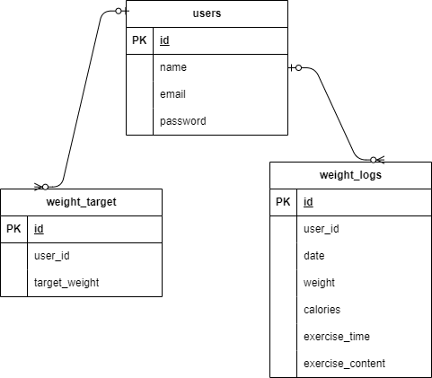

# 確認テスト　Pigly

- Dockerビルド

- git clone git@github.com:qliangtai34/Pigly.git 
- docker-compose up -d --build

## Laravel環境構築

- docker-compose exec php bash 
- composer install 
- .env.exampleファイルから.envを作成し、環境変数を変更 
- php artisan key:generate 
- php artisan migrate 
- php artisan db:seed

## 使用技術

- PHP 8.0 Laravel 8.0 MySQL 8.0

## ER図

## URL

- 開発環境:http://localhost/ 
- phpMyadmin:http://localhost:8080/